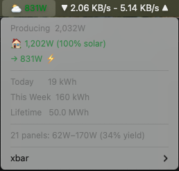

# EnvoyStats

Display the status of your Enphase Envoy (IQ Gateway) solar system in your macOS menu bar using [xbar](https://xbarapp.com/).

Queries your Envoy on the local network over HTTPS using token-based authentication. No external dependencies — uses only Python 3 standard library and macOS Keychain for secure token storage.



## Menu Bar Display

The menu bar icon changes based on your power state:

| Icon | Meaning |
|------|---------|
| ☀️   | Exporting to grid, producing above 50% of system capacity |
| ⛅   | Exporting to grid, producing below 50% of system capacity |
| 🔌   | Importing from grid |

The dropdown shows:

- Current production (watts)
- House consumption with solar percentage
- Grid import/export with direction arrows
- Energy totals (today, this week, lifetime)
- Per-panel output range and system yield

## Migrating from v1 (Ruby script)

Enphase firmware D8.x changed the Envoy (IQ Gateway) to require HTTPS and token-based authentication. The previous Ruby script used HTTP and digest auth which no longer works. This version has been rewritten in Python 3 with:

- HTTPS support (with self-signed certificate handling)
- JWT token authentication via Enphase cloud
- Secure token storage in macOS Keychain (no plaintext files)
- Built-in `--setup` command for token management

If upgrading, remove the old `solar.4m.rb` from your plugins directory and follow the setup steps below.

## Setup

### 1. Install xbar

Download and install from [xbarapp.com](https://xbarapp.com/).

### 2. Copy the script

Download `solar.4m.py` and place it in your xbar plugins directory:

```
~/Library/Application Support/xbar/plugins/
```

Make it executable:

```bash
chmod +x ~/Library/Application\ Support/xbar/plugins/solar.4m.py
```

### 3. Run setup

Once installed, the menu bar will show a warning icon. Click it and select **Run setup...** to open Terminal and configure everything interactively.

You can also run setup from the command line:

```bash
python3 ~/Library/Application\ Support/xbar/plugins/solar.4m.py --setup
```

Setup will prompt for:

- **Envoy IP address** — find this via the Enlighten app (Menu > Devices > Envoy > Connect Locally) or your router's connected devices list
- **System size in watts** — used to calculate yield percentage
- **Enphase account credentials** — the same email/password you use for the Enlighten app

The setup fetches a JWT token from Enphase and stores it securely in your macOS Keychain. Configuration (IP and system size) is saved to `solar.config.json` alongside the script. The token is valid for 1 year — the script will warn you when it's about to expire, and you can re-run setup from the menu bar to refresh it.

### 4. Refresh rate

xbar uses the filename to determine how often the script runs. The default `solar.4m.py` runs every 4 minutes. Rename the file to change the interval (e.g. `solar.2m.py` for every 2 minutes). Don't go below 1 minute to avoid overloading your Envoy.
